# WildBosses 🐾⚔️


**[Modrinth](https://modrinth.com/mod/wildbosses) · [Source](https://github.com/kaizzinho/WildBosses) · [Issues](https://github.com/kaizzinho/WildBosses/issues)**

*Read this in [English](#english) | Leia em [Português](#português)*

---

## English

### Overview

**WildBosses** adds rare roaming Boss Pokémon to [Cobblemon](https://cobblemon.com/).

Instead of spawning separate scripted encounters, the mod can promote an ordinary wild Pokémon into a Boss with its own tier, glow, hidden overworld level, battle scaling, aggressive AI, progression, and reward pool.

Bosses are designed as an endgame PvE activity. They remain part of Cobblemon's normal entity and battle systems rather than replacing or forking them.

### What it does

A normal encounter can become a Boss like this:

```text
a wild Pokémon spawns
    ↓
WildBosses rolls the Boss chance
    ↓
a tier is selected
    ↓
the Pokémon becomes a roaming Boss
    ↓
its overworld level is hidden as Lv. ??
    ↓
a player challenges it
    ↓
its battle level and moveset are rebuilt for that player
    ↓
the battle is forced into 1v1
    ↓
Enrage and Mega Evolution may activate
    ↓
victory resolves Boss rewards and progression
```

The Boss is not permanently tied to the player who caused it to appear. Another player can find and challenge the same roaming Boss.

### Key Features

- [x] Five Boss tiers from **Uncommon** to **Mythic**.
- [x] Configurable promotion chance for normal wild spawns.
- [x] Tier-colored glow visible through walls and underwater.
- [x] Hidden overworld level shown as `Lv. ??`.
- [x] Dynamic battle scaling from the challenger's strongest party Pokémon.
- [x] Configurable Boss level cap with a default of **200**.
- [x] Forced **1v1** Boss encounters.
- [x] Aggressive Boss AI focused on KOs, STAB, type effectiveness, coverage, accuracy, priority, and useful multi-hit damage.
- [x] Danger coverage against important **4× weaknesses** when a good legal move exists.
- [x] Awareness of telegraphed **2× and 4×** incoming threats.
- [x] Proper delayed-damage handling for **Future Sight** and **Doom Desire**.
- [x] Limited aggressive setup and emergency recovery for stronger tiers.
- [x] Configurable **Enrage** for Rare+ Bosses.
- [x] Optional Mega Evolution support for eligible high-tier Bosses.
- [x] One-time Mega Stone progression rewards per species and player.
- [x] Epic+ final-evolution enforcement and perfect IVs by default.
- [x] Increased shiny odds for Legendary and Mythic Bosses.
- [x] Persistent per-player spawn cooldowns.
- [x] Boss-state recovery across chunk and world reloads.
- [x] Persistent Boss kill leaderboard.
- [x] WildBosses advancement tree.
- [x] Datapack-friendly vanilla loot tables.
- [x] Admin and testing command suite under `/wildbosses` and `/wb`.
- [x] Public metadata and loot-award APIs for optional integrations.
- [x] Soft integration with **Cobblemon Battle Slider**, **CobbleTunes**, and **Cobblemon Loot Menu**.

### Boss tiers

| Tier | Default weight | Level bonus | AI skill | Shiny chance | Perfect IVs | Mega chance* |
|---|---:|---:|---:|---:|---|---:|
| **Uncommon** | 54 | +5 | 2 | 0% | No | 0% |
| **Rare** | 30 | +10 | 3 | 0% | No | 0% |
| **Epic** | 10 | +15 | 4 | 0% | Yes | 0% |
| **Legendary** | 5 | +20 | 5 | 25% | Yes | 50% |
| **Mythic** | 1 | +25 | 5 | 45% | Yes | 100% |

The weights describe the tier distribution **after a spawn has already passed the Boss promotion roll**. They are not the global chance for a random Pokémon to become a Boss.

\* Mega Evolution still requires a compatible Mega form and compatible Mega Evolution data.

Every value in the table is configurable.

### Showcase

#### Boss spawn alert

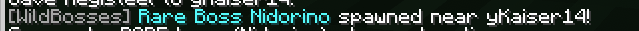

#### Finding a Boss

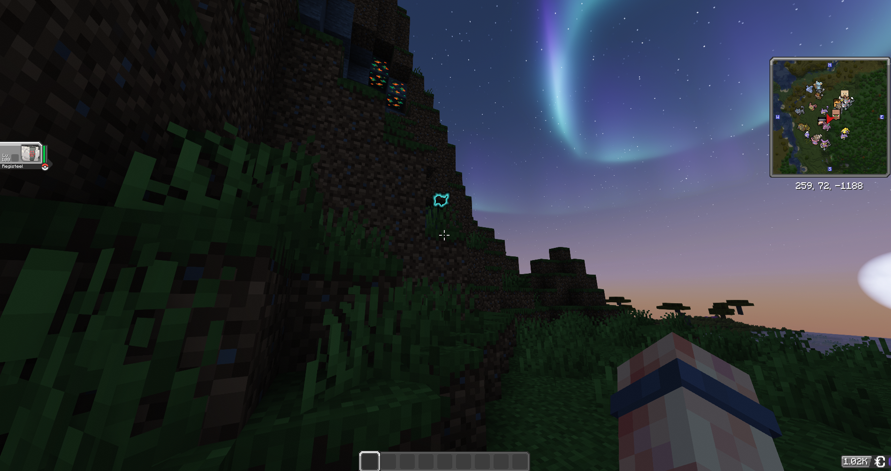
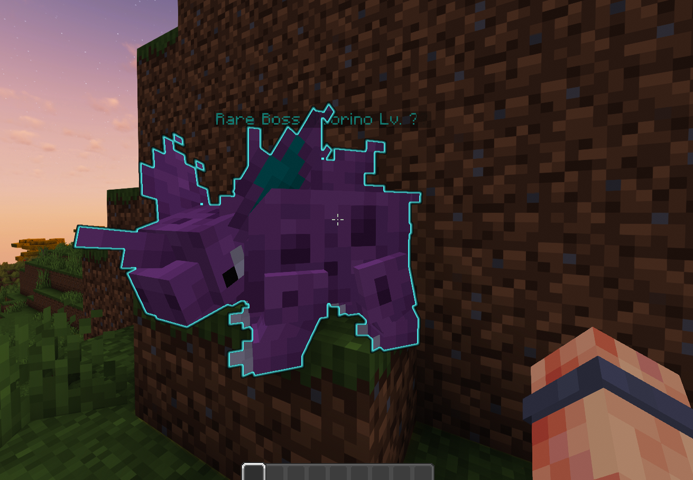

#### Mythic Boss

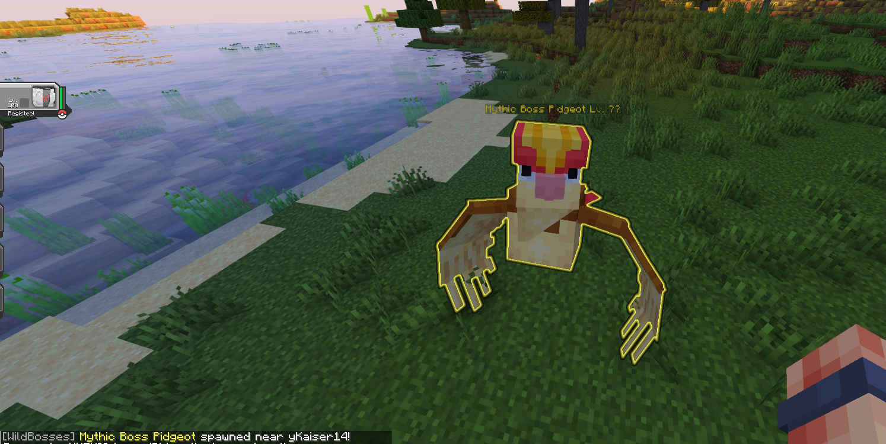
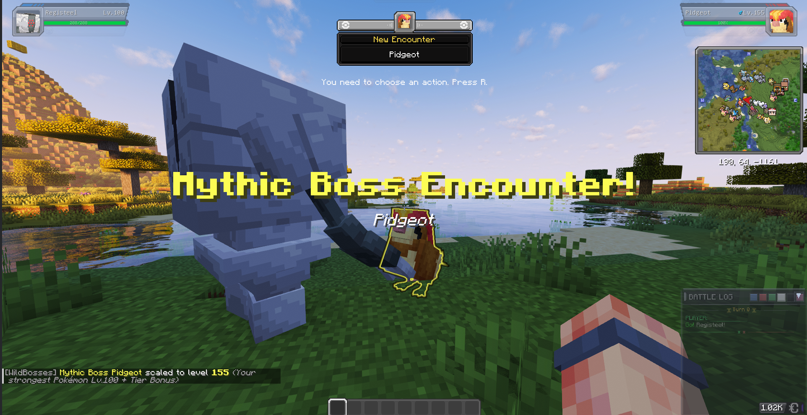

#### Enrage and Mega Evolution

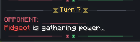
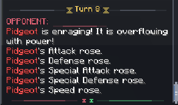
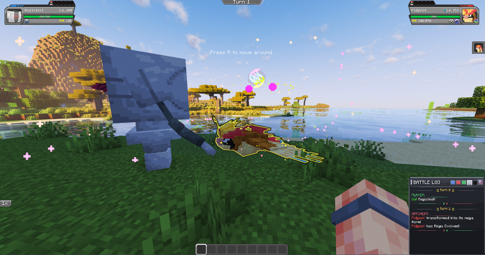

#### Battle Slider integration

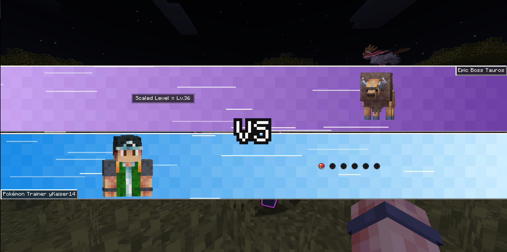

#### Loot Menu Integration

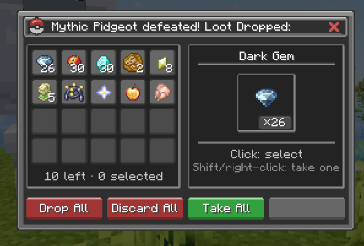

#### Advancements

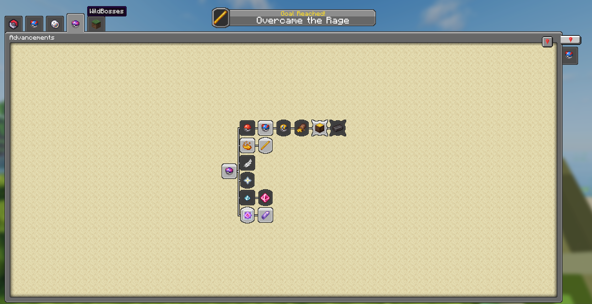

### Requirements

#### Required

- Minecraft `1.21.1`
- Java `21`
- Fabric Loader `0.17.2+`
- Fabric API and Cobblemon's required Fabric dependencies
- Fabric Language Kotlin `1.13.6+kotlin.2.2.20+`
- Cobblemon `1.7.3+`

#### Optional integrations

- **Mod Menu `11.0.3+` + YACL `3.8.1+`** — in-game WildBosses configuration screen.
- **Cobblemon Battle Slider** — dedicated Boss VS presentation.
- **CobbleTunes** — region-aware Boss battle music.
- **Cobblemon Loot Menu** — combines regular Boss rewards with the defeated species' normal loot.
- **Compatible Mega Evolution data such as MegaShowdown** — enables supported Boss Mega Evolutions and Mega Stone progression.

WildBosses remains functional when these optional mods are absent.

### Dynamic level scaling

A Boss does not keep one permanent battle level.

When a player starts the encounter, WildBosses reads the strongest Pokémon in that player's party and adds the configured tier bonus.

For example:

```text
strongest party Pokémon  Lv. 72
Epic tier bonus          +15
-----------------------------
Boss battle level        Lv. 87
```

Before battle, the overworld label still shows `Lv. ??`.

If another player challenges the Boss later, the level is calculated again from that player's party. Levels above 100 continue through Cobblemon's normal stat formulas for HP, Attack, Defense, Sp. Atk, Sp. Def, and Speed.

### Battle rules

Boss encounters are forced into **1v1**.

If the player wins, the Boss is defeated and the reward flow begins.

If the player loses or flees, the Boss returns to full HP and remains available for another attempt. The next challenger receives a fresh level calculation.

Bosses cannot be captured.

### Aggressive Boss AI

WildBosses intentionally makes Bosses behave differently from competitive trainers. They focus on ending the fight rather than building a long stall plan.

The AI scores usable attacks from the current matchup and strongly favors immediate KOs. It also considers:

- STAB;
- type effectiveness;
- physical and special offensive stats;
- accuracy;
- priority;
- useful multi-hit damage;
- common type-immunity abilities;
- the value of risky self-nerfing attacks when the payoff is worth it.

Higher `aiSkill` values make decisions more consistent. Epic+ Bosses can receive one aggressive setup option, while Legendary and Mythic Bosses may keep one emergency recovery move when badly hurt and no immediate KO is available.

#### Danger coverage

If a species has a 4× defensive weakness, WildBosses searches its legal attacks for a useful move that can punish Pokémon of that threatening type.

This is type-driven rather than species-hardcoded. Weak or badly matched coverage is rejected instead of being forced into the moveset.

| Tier | 4× weakness coverage | Telegraph reaction |
|---|---|---|
| **Uncommon** | Moderate preference | Usually reacts |
| **Rare** | Strong preference | Reacts most of the time |
| **Epic** | Near-guaranteed when a good move exists | Almost always reacts |
| **Legendary** | Guaranteed when a good move exists | Perfect awareness |
| **Mythic** | Guaranteed when a good move exists | Perfect awareness |

The AI can also react to a damaging two-turn move that was visibly prepared on the previous turn. A 2× incoming hit discourages greedy setup. A 4× incoming hit becomes a danger state that skips setup and recovery in favor of the best immediate non-delayed attack.

**Future Sight** and **Doom Desire** are handled as delayed damage. They cannot steal the normal instant-KO bonus and are blocked while a previous delayed hit is still pending.

Enable `bossAiDebugLogging` to print moveset and turn-scoring diagnostics to the console.

### Enrage

By default, Rare, Epic, Legendary, and Mythic Bosses Enrage every **8 turns**. Uncommon Bosses do not use Enrage.

One turn before the next Enrage, the player receives a warning. When it triggers, the Boss gains the configured number of stages in Attack, Defense, Sp. Atk, Sp. Def, and Speed.

The default is **+1 stage** per Enrage, still respecting the normal battle-stage ceiling.

### Mega Evolution

Eligible high-tier Bosses can use compatible Mega Evolution data.

Default chances:

- Uncommon: `0%`
- Rare: `0%`
- Epic: `0%`
- Legendary: `50%`
- Mythic: `100%`

The Boss must still have a compatible Mega form. A configured chance does not create a form that does not exist.

#### Mega Stone rewards

Mega Stones are only awarded when the defeated Boss **actually Mega Evolved during that battle**.

The stone is granted directly to the player and never enters the normal tier loot pool or Cobblemon Loot Menu session.

Each Mega Stone is a **one-time reward per species per player**:

```text
first Mega Pidgeot defeated   Pidgeotite awarded
later Mega Pidgeot defeats    no extra Pidgeotite
Mega Charizard defeated       its own stone can still be awarded
```

This makes Mega Stones progression rewards instead of repeatable farm loot.

### Spawn and lifecycle

Default global values:

```text
Boss spawn chance       1 / 512
Spawn cooldown          15 minutes
Boss lifetime           10 minutes
Maximum scaled level    200
Enrage interval         8 turns
Enrage strength         +1 stage
Boss AI debug logging   off
```

The spawn cooldown belongs to the player who caused the Boss promotion. It does not stop that player from fighting an already-existing Boss.

An untouched Boss normally roams for about 10 minutes before leaving.

#### Persistence and recovery

Active Bosses are marked as persistent entities and keep redundant Boss identity data for recovery.

WildBosses restores the tracked tier, Boss metadata, hidden level presentation, scoreboard team, tier color, glow, and lifetime timestamp when a Boss entity is loaded again.

Checkpoint requests are used around important lifecycle changes so active Bosses and completed removals do not depend only on Minecraft's later autosave cycle.

The in-memory Boss registry is also cleared when the server stops so integrated-server sessions do not retain stale entries.

### Species restrictions

Legendary, Mythical, and Ultra Beast species are excluded from becoming WildBosses by default.

WildBosses reads Cobblemon species labels instead of maintaining a separate hardcoded Pokémon list. The blocked labels can be changed in configuration.

### Rewards

Each tier uses a normal Minecraft loot table:

```text
data/wildbosses/loot_table/boss/uncommon.json
data/wildbosses/loot_table/boss/rare.json
data/wildbosses/loot_table/boss/epic.json
data/wildbosses/loot_table/boss/legendary.json
data/wildbosses/loot_table/boss/mythic.json
```

Reward pools can include type gems, evolution items, held items, healing items, relic coins, and higher-tier rare rewards.

Because these are normal loot tables, modpack and server authors can override them through datapacks without rebuilding WildBosses.

#### Datapack override

Use the same namespace and path as the built-in table you want to replace:

```text
<world>/datapacks/my_wildbosses_loot/
└─ data/
   └─ wildbosses/
      └─ loot_table/
         └─ boss/
            └─ mythic.json
```

For Minecraft `1.21.1`, a minimal `pack.mcmeta` uses data pack format `48`.

After editing the datapack, run:

```text
/reload
```

or use:

```text
/wb reload
```

Then test a tier directly with:

```text
/wb loot mythic
```

Mega Stones are not part of these tier loot tables.

### Cobblemon Loot Menu integration

WildBosses exposes `WildBossLootAwardEvent` so another server-side mod can take responsibility for a generated Boss reward before WildBosses gives it normally.

Cobblemon Loot Menu uses this to combine:

```text
WildBosses tier reward
        +
normal Cobblemon species loot
        ↓
one server authoritative reward selection
```

If the integration claims the event, WildBosses does not award the same stacks again.

Mega Stones intentionally bypass this flow and go directly to the eligible player.

### Progression

WildBosses includes a persistent kill leaderboard and its own advancement tree.

Current advancement goals include:

- defeating the first Boss;
- defeating each individual tier;
- defeating 5 Bosses;
- defeating 25 Bosses;
- defeating at least one Boss of every tier;
- surviving and overcoming Enrage;
- defeating a shiny Boss;
- successfully fleeing from a Boss encounter;
- defeating a Boss that Mega Evolved;
- receiving the first Mega Stone from a Boss.

Leaderboard commands:

```text
/wb leaderboard
/wb leaderboard mythic
```

### Optional cross-mod integrations

#### Cobblemon Battle Slider

When Battle Slider is installed, WildBoss encounters can use a dedicated VS introduction.

The integration can show:

- tier-colored Boss side;
- a label such as `Mythic Boss Garchomp`;
- authoritative scaled level such as `Scaled Level = Lv.125`;
- the real Pokémon rendered as the Boss portrait;
- temporary overworld Boss name-tag suppression while the intro is active.

WildBosses suppresses its own normal encounter title while Battle Slider is loaded so the two presentations do not overlap.

The integration is soft and WildBosses keeps its original encounter presentation when Battle Slider is absent.

#### CobbleTunes

When CobbleTunes is installed, Boss battles can receive region-aware music based on the Boss species.

The music integration is soft and WildBosses does not bundle extra soundtrack files.

### Configuration

The first launch creates:

```text
config/wildbosses/wildbosses.json
```

With Mod Menu and YACL installed on the client, the same settings are available through:

```text
Mods
→ WildBosses
→ Configure
```

The configuration controls:

- global Boss spawn chance;
- per-player spawn cooldown;
- blocked Cobblemon species labels;
- maximum scaled Boss level;
- Enrage interval and strength;
- Boss lifetime;
- tier weights;
- level bonuses;
- AI skill;
- AI debug logging;
- shiny chance;
- guaranteed perfect IVs;
- Mega Evolution chance.

Reload gameplay configuration without restarting the server:

```text
/wb reloadconfig
```

### Admin and testing commands

`/wildbosses` and `/wb` point to the same command tree.

```text
/wb help

/wb spawn <tier> [pokemon properties...] [respectCooldown=true]
/wb list
/wb info <target>
/wb debugentity <target>
/wb teleport <target>
/wb despawn <target>
/wb forcebattle <target>

/wb loot <tier>
/wb setlevel <target> <level>
/wb glow <target>
/wb tier <target> <tier>

/wb cooldown
/wb leaderboard [tier]

/wb reload
/wb reloadconfig
/wb killall
/wb version
```

`/wb spawn` accepts Cobblemon `PokemonProperties`, including forms and aspects. For example:

```text
/wb spawn epic exeggutor alolan
```

`respectCooldown` defaults to `false` for admin testing.

`/wb debugentity` prints raw persistence and synchronized Boss state for the selected Pokémon and is intended for lifecycle troubleshooting.

### Public API

`WildBossIntegrationApi` exposes lightweight Boss metadata:

```text
isBoss(PokemonEntity)
getTierName(PokemonEntity / UUID)
getTierNameByPokemonUuid(UUID)
getScaledLevel(PokemonEntity / UUID)
```

Optional integrations should still check that WildBosses is loaded before calling the API.

Server-side reward integrations can subscribe to `WildBossLootAwardEvent`, which exposes the Boss entity UUID, player, level, position, species name, tier name, generated stacks, and claimed state.

`claim()` should only be called after the integration has actually taken responsibility for resolving the reward.

### Installation

1. Install Fabric Loader for Minecraft `1.21.1`.
2. Install Fabric API, Fabric Language Kotlin, Cobblemon, and Cobblemon's required dependencies.
3. Place the WildBosses JAR in the `mods` folder.
4. Start the game or server once to generate the configuration.
5. Add optional integrations as desired.

For multiplayer, use the same WildBosses build on the server and clients that need its client-side Boss presentation behavior.

### Building from source

Java `21` is required.

#### Windows

```powershell
.\gradlew clean build
```

#### Linux or macOS

```bash
./gradlew clean build
```

The compiled JAR is generated by the project's Gradle build output.

### Known limitations

- The current target is Minecraft `1.21.1` with Cobblemon `1.7.3+`.
- Mega Evolution depends on compatible external Mega data for the species being fought.
- Cross-mod integrations can require updates when another mod changes its internal API or resource format.
- A process killed before an in-progress world save finishes can still lose the newest unsaved state.
- Dedicated-server behavior should be validated in the exact modpack before a public release.

### Roadmap

Current planned areas include:

- continued Mega compatibility testing;
- possible **Myths and Legends** integration for Legendary and Mythical rewards;
- additional balance and compatibility testing;
- a Cobblemon `1.8` port after the `1.7.3` build is stabilized.

### Credits

- Created by **Kaizzinho**.
- Built for [Cobblemon](https://cobblemon.com/).
- Optional integration with Cobblemon Battle Slider.
- Optional integration with CobbleTunes.
- Optional integration with Cobblemon Loot Menu.
- Optional compatible Mega Evolution data support.

### License

WildBosses is available under the **MIT License**.

Pokémon, Pokémon names, and related intellectual property belong to their respective rights holders.

---

## Português

### Visão geral

**WildBosses** adiciona Pokémon Boss raros que vagam naturalmente pelo mundo do [Cobblemon](https://cobblemon.com/).

Em vez de criar encontros separados ou roteirizados, o mod pode promover um Pokémon selvagem comum a Boss com tier próprio, brilho, nível escondido no overworld, escalonamento de batalha, IA agressiva, progressão e pool de recompensas.

Os Bosses foram pensados como uma atividade PvE de endgame. Eles continuam usando as entidades e o sistema de batalha normal do Cobblemon em vez de substituir ou criar um fork desses sistemas.

### Como funciona

Um encontro normal pode virar Boss assim:

```text
um Pokémon selvagem spawna
    ↓
WildBosses rola a chance de Boss
    ↓
um tier é escolhido
    ↓
o Pokémon vira um Boss que vaga pelo mundo
    ↓
o nível no overworld fica escondido como Lv. ??
    ↓
um jogador desafia o Boss
    ↓
o nível e o moveset são refeitos para esse jogador
    ↓
a batalha é forçada para 1v1
    ↓
Enrage e Mega Evolução podem ativar
    ↓
a vitória resolve recompensas e progressão
```

O Boss não fica preso ao jogador que causou seu spawn. Outro jogador pode encontrar e desafiar o mesmo Boss.

### Funcionalidades principais

- [x] Cinco tiers de Boss entre **Uncommon** e **Mythic**.
- [x] Chance configurável de um spawn selvagem normal virar Boss.
- [x] Brilho colorido por tier visível através de paredes e debaixo d'água.
- [x] Nível escondido no overworld como `Lv. ??`.
- [x] Escalonamento dinâmico baseado no Pokémon mais forte da party do desafiante.
- [x] Nível máximo configurável com padrão de **200**.
- [x] Encontros Boss forçados para **1v1**.
- [x] IA agressiva focada em KOs, STAB, efetividade de tipo, cobertura, precisão, prioridade e multi-hit útil.
- [x] Cobertura contra fraquezas importantes de **4×** quando existe um golpe legal bom.
- [x] Consciência de ameaças anunciadas de **2× e 4×**.
- [x] Tratamento correto de dano atrasado para **Future Sight** e **Doom Desire**.
- [x] Setup agressivo limitado e recuperação de emergência nos tiers mais fortes.
- [x] **Enrage** configurável para Bosses Rare+.
- [x] Suporte opcional a Mega Evolução para Bosses elegíveis de tier alto.
- [x] Mega Stones únicas por espécie e por jogador como progressão.
- [x] Bosses Epic+ forçados para a evolução final e IVs perfeitos por padrão.
- [x] Chance maior de shiny em Legendary e Mythic.
- [x] Cooldown de spawn persistente por jogador.
- [x] Recuperação do estado do Boss após unload de chunk e reload do mundo.
- [x] Leaderboard persistente de Bosses derrotados.
- [x] Árvore própria de advancements.
- [x] Loot tables vanilla fáceis de sobrescrever com datapacks.
- [x] Comandos administrativos e de teste em `/wildbosses` e `/wb`.
- [x] APIs públicas para metadados e recompensas.
- [x] Integração leve com **Cobblemon Battle Slider**, **CobbleTunes** e **Cobblemon Loot Menu**.

### Tiers de Boss

| Tier | Peso padrão | Bônus de nível | IA | Chance shiny | IVs perfeitos | Chance Mega* |
|---|---:|---:|---:|---:|---|---:|
| **Uncommon** | 54 | +5 | 2 | 0% | Não | 0% |
| **Rare** | 30 | +10 | 3 | 0% | Não | 0% |
| **Epic** | 10 | +15 | 4 | 0% | Sim | 0% |
| **Legendary** | 5 | +20 | 5 | 25% | Sim | 50% |
| **Mythic** | 1 | +25 | 5 | 45% | Sim | 100% |

Os pesos representam a distribuição dos tiers **depois que um spawn já passou no roll para virar Boss**. Eles não são a chance global de qualquer Pokémon virar Boss.

\* A Mega Evolução ainda exige uma forma compatível e dados compatíveis de Mega Evolução.

Todos os valores da tabela podem ser configurados.

### Showcase

#### Alerta de Spawn


#### Encontrando um Boss


#### Boss Mítico


#### Mecânica de Enrage e Mega Evolução


#### Integração com o Cobblemon Battle Slider


#### Integração com Cobblemon Loot Menu


#### Conquistas


### Requisitos

#### Obrigatórios

- Minecraft `1.21.1`
- Java `21`
- Fabric Loader `0.17.2+`
- Fabric API e dependências Fabric exigidas pelo Cobblemon
- Fabric Language Kotlin `1.13.6+kotlin.2.2.20+`
- Cobblemon `1.7.3+`

#### Integrações opcionais

- **Mod Menu `11.0.3+` + YACL `3.8.1+`** — tela de configuração dentro do jogo.
- **Cobblemon Battle Slider** — apresentação VS dedicada para Bosses.
- **CobbleTunes** — música de batalha regional para Bosses.
- **Cobblemon Loot Menu** — combina a recompensa normal do Boss com o loot normal da espécie derrotada.
- **Dados compatíveis de Mega Evolução como MegaShowdown** — habilitam Mega Evoluções suportadas e a progressão de Mega Stones.

O WildBosses continua funcionando sem essas integrações opcionais.

### Escalonamento dinâmico de nível

Um Boss não mantém um único nível permanente de batalha.

Quando um jogador inicia o encontro, o WildBosses lê o Pokémon mais forte da party e adiciona o bônus configurado para o tier.

Exemplo:

```text
Pokémon mais forte       Lv. 72
Bônus do tier Epic       +15
-----------------------------
Nível do Boss            Lv. 87
```

Antes da batalha, o overworld continua mostrando `Lv. ??`.

Se outro jogador desafiar o mesmo Boss depois, o nível é calculado novamente a partir da party dele. Acima do nível 100, HP, Attack, Defense, Sp. Atk, Sp. Def e Speed continuam usando as fórmulas normais do Cobblemon.

### Regras de batalha

Encontros Boss são forçados para **1v1**.

Se o jogador vencer, o Boss é derrotado e o fluxo de recompensa começa.

Se o jogador perder ou fugir, o Boss volta ao HP máximo e continua disponível. O próximo desafiante recebe um novo cálculo de nível.

Bosses não podem ser capturados.

### IA agressiva dos Bosses

A IA foi feita para agir diferente de um treinador competitivo. O foco é encerrar a luta em vez de montar um plano longo de stall.

Os golpes são pontuados de acordo com o confronto atual e KOs imediatos recebem grande prioridade. A IA também considera:

- STAB;
- efetividade de tipo;
- stats físicos e especiais;
- precisão;
- prioridade;
- dano útil de multi-hit;
- imunidades comuns por habilidade;
- valor de golpes arriscados que reduzem os próprios stats quando o ganho compensa.

Valores maiores de `aiSkill` deixam as escolhas mais consistentes. Bosses Epic+ podem receber um setup agressivo, enquanto Legendary e Mythic podem manter uma recuperação de emergência quando estão muito feridos e não existe KO imediato.

#### Cobertura contra perigo

Se uma espécie possui uma fraqueza defensiva de 4×, o WildBosses procura entre seus golpes legais uma opção boa para punir Pokémon daquele tipo ameaçador.

A lógica é baseada em tipagem e não em hardcode por espécie. Cobertura ruim ou incompatível com os stats ainda é descartada.

| Tier | Cobertura contra fraqueza 4× | Reação a golpe anunciado |
|---|---|---|
| **Uncommon** | Preferência moderada | Normalmente reage |
| **Rare** | Preferência forte | Reage na maior parte das vezes |
| **Epic** | Quase garantida quando existe um golpe bom | Quase sempre reage |
| **Legendary** | Garantida quando existe um golpe bom | Consciência perfeita |
| **Mythic** | Garantida quando existe um golpe bom | Consciência perfeita |

A IA também pode reagir a um golpe ofensivo de dois turnos preparado no turno anterior. Uma ameaça de 2× reduz setup ganancioso. Uma ameaça de 4× vira estado de perigo e força uma resposta ofensiva imediata sem setup ou recuperação.

**Future Sight** e **Doom Desire** são tratados como dano atrasado. Eles não recebem o bônus normal de KO imediato e ficam bloqueados enquanto outro dano atrasado ainda está pendente.

Ative `bossAiDebugLogging` para imprimir moveset e diagnósticos de score no console.

### Enrage

Por padrão, Bosses Rare, Epic, Legendary e Mythic entram em Enrage a cada **8 turnos**. Uncommon não usa Enrage.

Um turno antes, o jogador recebe um aviso. Quando ativa, o Boss ganha a quantidade configurada de estágios em Attack, Defense, Sp. Atk, Sp. Def e Speed.

O padrão é **+1 estágio**, respeitando o limite normal da batalha.

### Mega Evolução

Bosses elegíveis de tier alto podem usar dados compatíveis de Mega Evolução.

Chances padrão:

- Uncommon: `0%`
- Rare: `0%`
- Epic: `0%`
- Legendary: `50%`
- Mythic: `100%`

O Boss ainda precisa ter uma forma Mega compatível. A chance configurada não cria uma forma que não existe.

#### Recompensas de Mega Stone

Mega Stones só são recebidas quando o Boss derrotado **realmente Mega Evoluiu naquela batalha**.

A pedra vai direto para o jogador e nunca entra no loot normal do tier nem na sessão do Cobblemon Loot Menu.

Cada Mega Stone é uma **recompensa única por espécie e por jogador**:

```text
primeiro Mega Pidgeot derrotado   recebe Pidgeotite
outros Mega Pidgeot               sem Pidgeotite extra
Mega Charizard derrotado          sua própria pedra ainda pode cair
```

Assim as Mega Stones funcionam como progressão e não como farm repetível.

### Spawn e ciclo de vida

Valores globais padrão:

```text
Chance de Boss            1 / 512
Cooldown de spawn         15 minutos
Tempo de vida             10 minutos
Nível máximo              200
Intervalo do Enrage       8 turnos
Força do Enrage           +1 estágio
Debug da IA               desligado
```

O cooldown pertence ao jogador que causou a promoção para Boss. Ele não impede esse jogador de enfrentar um Boss que já existe.

Um Boss intocado normalmente vaga por cerca de 10 minutos antes de ir embora.

#### Persistência e recuperação

Bosses ativos são marcados como entidades persistentes e mantêm informações redundantes de identidade para recuperação.

Quando a entidade é carregada novamente, o WildBosses restaura tier, metadados de Boss, nível escondido, scoreboard team, cor do tier, brilho e timestamp de vida.

Checkpoints são solicitados em mudanças importantes do ciclo de vida para que Bosses ativos e remoções concluídas não dependam apenas de um autosave futuro do Minecraft.

O registro em memória também é limpo quando o servidor para para evitar entradas antigas entre sessões de servidor integrado.

### Restrições de espécies

Lendários, Míticos e Ultra Beasts são excluídos de virar WildBosses por padrão.

O mod lê as labels de species do Cobblemon em vez de manter uma lista hardcoded separada. As labels bloqueadas podem ser alteradas na configuração.

### Recompensas

Cada tier usa uma loot table normal do Minecraft:

```text
data/wildbosses/loot_table/boss/uncommon.json
data/wildbosses/loot_table/boss/rare.json
data/wildbosses/loot_table/boss/epic.json
data/wildbosses/loot_table/boss/legendary.json
data/wildbosses/loot_table/boss/mythic.json
```

Os pools podem incluir gemas de tipo, itens de evolução, held items, itens de cura, relic coins e recompensas raras de tiers altos.

Como são loot tables normais, autores de modpack e administradores podem sobrescrevê-las por datapack sem recompilar o WildBosses.

#### Override com datapack

Use o mesmo namespace e caminho da tabela original que deseja trocar:

```text
<mundo>/datapacks/meu_loot_wildbosses/
└─ data/
   └─ wildbosses/
      └─ loot_table/
         └─ boss/
            └─ mythic.json
```

No Minecraft `1.21.1`, um `pack.mcmeta` mínimo usa formato de datapack `48`.

Depois de alterar o datapack, rode:

```text
/reload
```

ou:

```text
/wb reload
```

Teste um tier diretamente com:

```text
/wb loot mythic
```

Mega Stones não fazem parte dessas loot tables.

### Integração com Cobblemon Loot Menu

O WildBosses expõe `WildBossLootAwardEvent` para outro mod server-side assumir a responsabilidade por uma recompensa antes da entrega normal.

Cobblemon Loot Menu usa isso para combinar:

```text
recompensa do tier WildBosses
        +
loot normal da espécie do Cobblemon
        ↓
uma seleção de recompensa controlada pelo servidor
```

Quando a integração chama `claim()`, o WildBosses não entrega os mesmos stacks de novo.

Mega Stones ignoram esse fluxo de propósito e vão diretamente para o jogador elegível.

### Progressão

O WildBosses possui leaderboard persistente e sua própria árvore de advancements.

A progressão atual inclui objetivos por:

- derrotar o primeiro Boss;
- derrotar cada tier individual;
- derrotar 5 Bosses;
- derrotar 25 Bosses;
- derrotar pelo menos um Boss de cada tier;
- sobreviver e superar um Enrage;
- derrotar um Boss shiny;
- fugir com sucesso de um encontro Boss;
- derrotar um Boss que Mega Evoluiu;
- receber a primeira Mega Stone de um Boss.

Comandos do leaderboard:

```text
/wb leaderboard
/wb leaderboard mythic
```

### Integrações opcionais entre mods

#### Cobblemon Battle Slider

Com Battle Slider instalado, encontros WildBoss podem receber uma intro VS dedicada.

A integração pode mostrar:

- lado do Boss na cor do tier;
- nome como `Mythic Boss Garchomp`;
- nível escalado autoritativo como `Scaled Level = Lv.125`;
- o Pokémon real como retrato do Boss;
- ocultação temporária da name tag do Boss no overworld durante a intro.

O WildBosses pula seu próprio título normal quando Battle Slider está carregado para evitar sobreposição das duas apresentações.

A integração é leve e o WildBosses mantém sua apresentação original quando Battle Slider não está instalado.

#### CobbleTunes

Com CobbleTunes instalado, batalhas Boss podem receber música baseada na região da espécie.

A integração é opcional e o WildBosses não inclui arquivos extras de trilha sonora.

### Configuração

Na primeira inicialização o mod cria:

```text
config/wildbosses/wildbosses.json
```

Com Mod Menu e YACL instalados no cliente, as mesmas opções aparecem em:

```text
Mods
→ WildBosses
→ Configure
```

A configuração controla:

- chance global de Boss;
- cooldown por jogador;
- labels de species bloqueadas;
- nível máximo escalonado;
- intervalo e força do Enrage;
- tempo de vida;
- pesos dos tiers;
- bônus de nível;
- habilidade da IA;
- logs de debug da IA;
- chance de shiny;
- IVs perfeitos garantidos;
- chance de Mega Evolução.

Recarregue a configuração sem reiniciar o servidor:

```text
/wb reloadconfig
```

### Comandos administrativos e de teste

`/wildbosses` e `/wb` apontam para a mesma árvore de comandos.

```text
/wb help

/wb spawn <tier> [pokemon properties...] [respectCooldown=true]
/wb list
/wb info <target>
/wb debugentity <target>
/wb teleport <target>
/wb despawn <target>
/wb forcebattle <target>

/wb loot <tier>
/wb setlevel <target> <level>
/wb glow <target>
/wb tier <target> <tier>

/wb cooldown
/wb leaderboard [tier]

/wb reload
/wb reloadconfig
/wb killall
/wb version
```

`/wb spawn` aceita `PokemonProperties` do Cobblemon incluindo forms e aspects. Exemplo:

```text
/wb spawn epic exeggutor alolan
```

`respectCooldown` usa `false` por padrão nos testes de admin.

`/wb debugentity` mostra o estado bruto de persistência e sincronização do Pokémon selecionado e serve para investigar problemas no ciclo de vida.

### API pública

`WildBossIntegrationApi` expõe metadados simples do Boss:

```text
isBoss(PokemonEntity)
getTierName(PokemonEntity / UUID)
getTierNameByPokemonUuid(UUID)
getScaledLevel(PokemonEntity / UUID)
```

Integrações opcionais ainda devem verificar se o WildBosses está carregado antes de chamar a API.

Mods server-side também podem assinar `WildBossLootAwardEvent`, que fornece UUID da entidade Boss, jogador, nível, posição, espécie, tier, stacks gerados e estado de `claimed`.

`claim()` só deve ser chamado depois que a integração realmente assumir a responsabilidade pela recompensa.

### Instalação

1. Instale Fabric Loader para Minecraft `1.21.1`.
2. Instale Fabric API, Fabric Language Kotlin, Cobblemon e as dependências exigidas pelo Cobblemon.
3. Coloque o JAR do WildBosses na pasta `mods`.
4. Inicie o jogo ou servidor uma vez para gerar a configuração.
5. Adicione integrações opcionais se desejar.

Em multiplayer, use a mesma build do WildBosses no servidor e nos clientes que precisam do comportamento visual client-side de Boss.

### Compilando o projeto

Java `21` é necessário.

#### Windows

```powershell
.\gradlew clean build
```

#### Linux ou macOS

```bash
./gradlew clean build
```

O JAR compilado é gerado pela saída configurada no projeto Gradle.

### Limitações conhecidas

- O alvo atual é Minecraft `1.21.1` com Cobblemon `1.7.3+`.
- Mega Evolução depende de dados externos compatíveis para a espécie enfrentada.
- Integrações entre mods podem precisar de atualização quando outro mod muda sua API interna ou formato de resources.
- Encerrar o processo antes de um save em andamento terminar ainda pode perder o estado mais recente não gravado.
- O comportamento em servidor dedicado deve ser validado no modpack exato antes de um release público.

### Créditos

- Criado por **Kaizzinho**.
- Feito para [Cobblemon](https://cobblemon.com/).
- Integração opcional com Cobblemon Battle Slider.
- Integração opcional com CobbleTunes.
- Integração opcional com Cobblemon Loot Menu.
- Suporte opcional a dados compatíveis de Mega Evolução.

### Licença

WildBosses está disponível sob a **MIT License**.

Pokémon, nomes de Pokémon e propriedades intelectuais relacionadas pertencem aos respectivos detentores de direitos.
